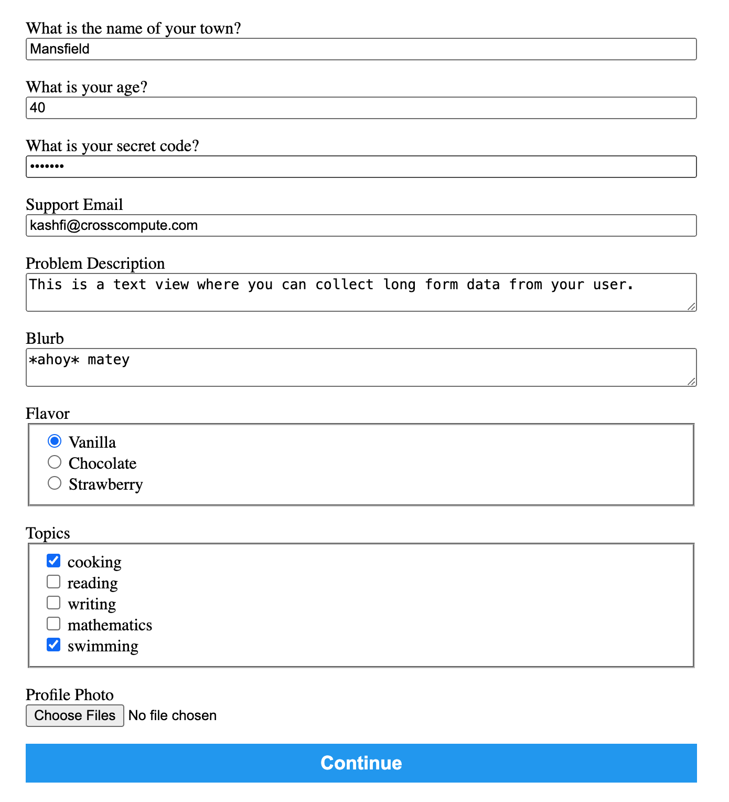

# Structure of CrossCompute's Automate.yml Config File
When working with the CrossCompute Framework you are going to be primarily customizing the configuration file called ```automate.yml```.  In this article let us explore the structure of this config file and some of its commonly used settings and parameters for automated processes or applications. 

The ```automate.yml``` file is divided into several key sections, each serving a distinct purpose. Let's break down these sections and explore the various views available for use.

### Header Section
- crosscompute: Specifies the version of the CrossCompute tool being used.
- name: Provides a name for the tool.
- version: Indicates the version of this particular configuration.

### Input Section
This section defines the inputs required by the application. Each input variable has an id, view, path, and additional attributes like label and configuration.
- variables: A list of different variables required as input, each having unique properties.
  - view: Specifies the type of input, like string, number, password, etc.
  - path: Indicates where the input data is stored or the source path.

### Output Section
This section is similar to the input section but defines the output variables of the application.
- Each output variable includes a view, path, and sometimes configuration and mode.
- view: Different types like link, string, number, image, etc., are used to define how the output will be presented.
- templates: Specifies markdown templates for output data.

### Batches Section
This section is tailored to define how batches of input data are processed.  It enables CrossCompute to handle multiple sets of input values efficiently, showcasing its ease of use in batch processing.  There are three key use cases that the Batches section addresses:
- Defining a Batch folder: This involves specifying a folder that contains a set of values for the input variables. It's like telling the system, "Here's where you'll find the batch of data to process." For example, if we defined our batches section with a folder ```- folder: batches/a``` attribute and value we're specifying to our tool that the subfolder ```a``` contains the necessary input data.
- Assorted Variable Values through a File: Here, the tool is configured to accept a file (like a CSV) containing various values for the variables. This approach is versatile, allowing for a wide range of input combinations.
- Using a Reference Folder for Default Values: In this use case we provide a folder with default values for the variables. It's particularly useful when you want to have a standard set of values but need the flexibility to modify some of them for specific batches.
It's important to ensure that the specified folder and subfolder exist in the project directory and contain the relevant data.

### Display Section
The display section specifies CSS styles and page configurations for the tool interface.
- styles: Links to CSS stylesheets.
- pages: Defines different pages of the tool interface, each with its own design configuration.

## Variety of Views
The automate.yml file supports a diverse range of views for both input and output variables. These views define how the data is presented or captured in the user interface. Some of the views include:

- Textual Views: string, number, text, markdown, and password. These are used for capturing or displaying basic text, numbers, or formatted text content.
- File Views: file, image, pdf, json, and table. These views handle file inputs and outputs, ranging from simple file uploads to displaying images and tables.
- Interactive Views: radio, checkbox, and frame. Used for interactive elements like radio buttons, checkboxes, or embedded frames. Frames can be used to render an interactive app or expose a web server within your tool, enabling the integration of complex web-based interfaces and functionalities directly within the workflow.
- Map Views: map-mapbox-location, map-mapbox, and map-deck-screengrid. These are specialized views for geographical data representation using maps.



In conclusion, the automate.yml file is a versatile configuration tool that allows for detailed customization of input and output variables, with a wide range of view options to cater to different data types and user interface requirements. Learning and understanding the structure and options available in this file will enhance the effectiveness and user-friendliness of your automated processes or applications.