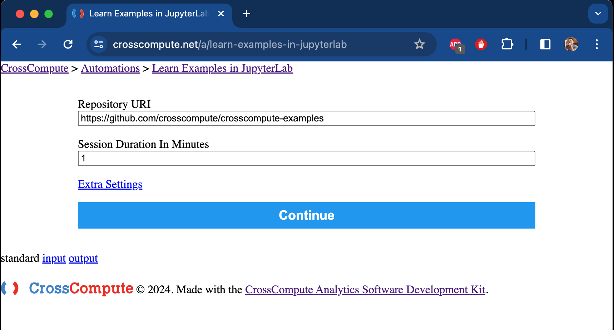
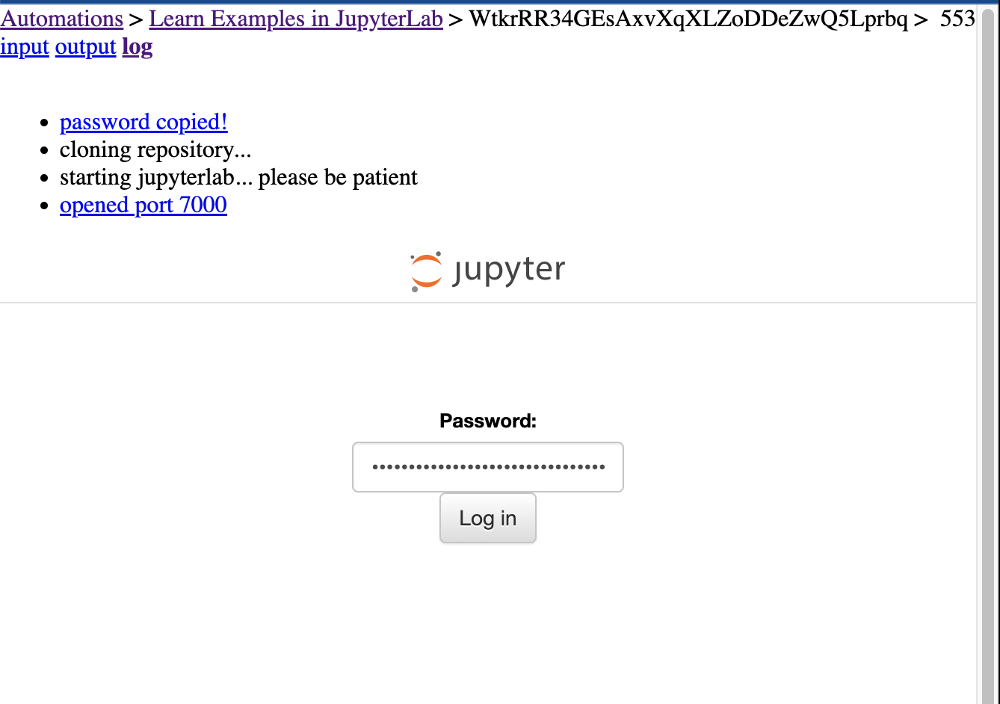
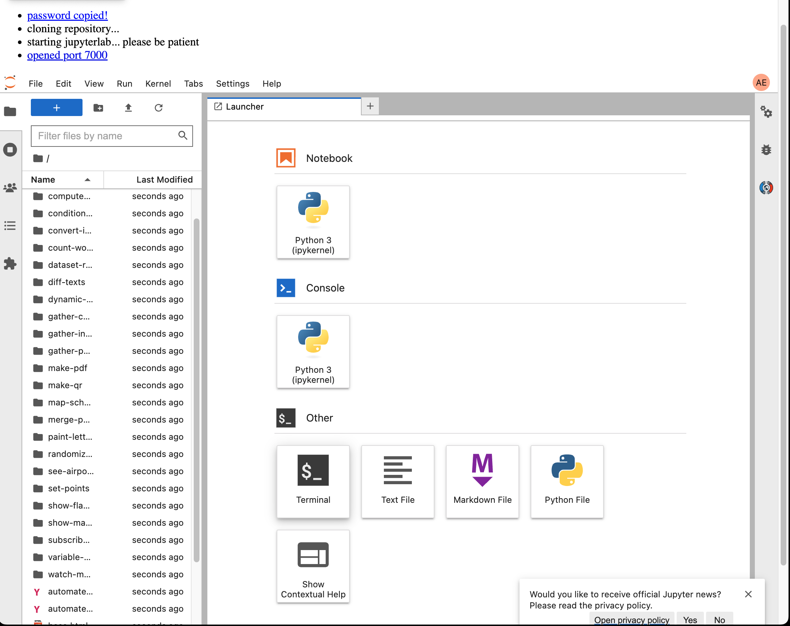
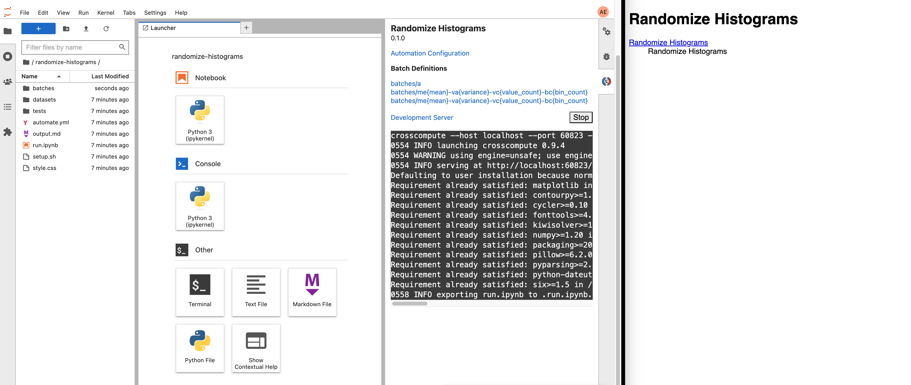
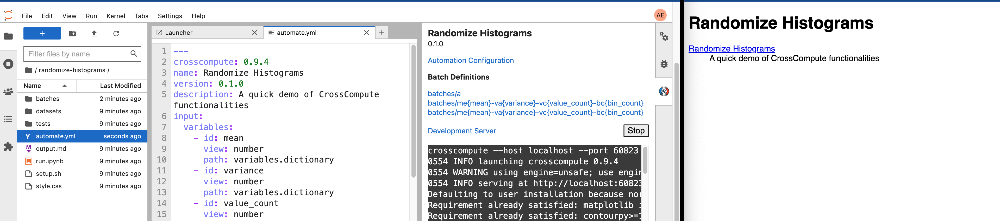

# CrossCompute's Online IDE

In this article, we are going to navigate and utilize CrossCompute's cloud-based Integrated Development Environment. Whether you're a beginner or an experienced user, the following steps will guide you through accessing our tools, managing your session, and making the most of the CrossCompute features.

## Using CrossCompute in the Cloud
To access our cloud-based CrossCompute IDE, visit  https://crosscompute.net/a/learn-examples-in-jupyterlab. 

The start screen will ask you to enter a Repository URI and a Session Duration in Minutes. The Repository URI input field will be prefilled with our example tools, and for this demonstration, you may leave that field as it is. In the next input field, specify the session duration in minutes. For instance, enter '10' for a 10-minute session. Adjust the time according to your needs. Now we are ready to continue, click Continue..

In the next screen, a password will be generated. Click on the password to copy it to your clipboard. Then paste it into the Password input field to log in to your CrossCompute IDE.

On the left side of the screen, you'll find a file browser displaying all example tools, and on the right, the CrossCompute button to open the CrossCompute panel.

Let's go to the File Explorer and scroll down to select the folder titled "randomize-histograms".

## Opening The CrossCompute Panel

After clicking on the "randomize-histograms" folder, click the CrossCompute panel to your right. You will see a Launch button; click the Launch button to launch the Development Server. In the image above, we see the Randomized Histogram web application on the right side of the screen, ready to be used.

## Auto-Refresh Updates to Your Configuration File 
In the last article, we discussed the main uses of auto-refresh. Let's try out the first use case where we update our configuration file, automate.yml. Double-click on automate.yml to open the file, then add a description attribute to it.

Underneath version, type in description, followed by a semi-colon :, and a few words to describe the tool, such as "A quick demo of CrossCompute functionalities". Then press Save. You will then see the auto-refresh in action as your update will display in the opening page of the web application.

## Modifying Your Templates
Next, let's modify the tool's template. For this tool, we have an output.md file that serves as the template for the application's results page. The template defines the look of your tool's output page. Double-click to open the file. The template includes a header and two output variables in { histogram_1d } and { histogram_2d }. After the header, add a new line with the text "Quick demo of auto-refresh" and then save the output.md file. You will notice auto-refresh instantly implements the change, as shown in the image.

## Wrapping Up: CrossCompute on the Cloud
We've just taken a quick tour of the CrossCompute cloud-based IDE and learned how to effectively navigate and utilize its features. From setting up your session to customizing templates and checking out auto-refresh in action, you're now well-equipped to explore and create with greater ease and efficiency.
